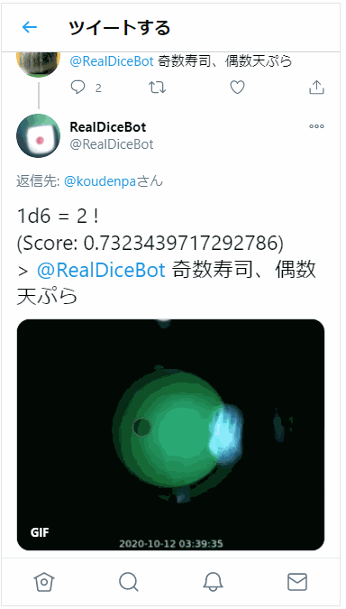
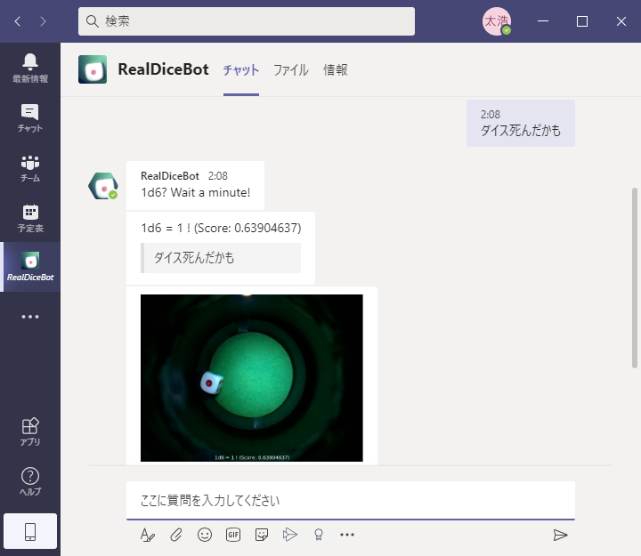
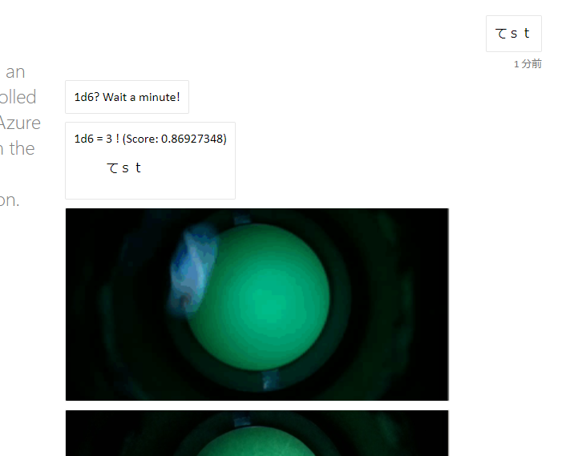

# RealDiceBot

6面ダイスを1つ振って応答するだけのボットです。

電動ダイスをAzure IoT EdgeデバイスのRaspberry Pi 3で制御して写真を撮っています。出目の判断もRaspberry Pi上で行っています。2と3の判断が甘いです。

## Live ReadDiceBot

IoT Edgeデバイスの様子はYouTube Liveで配信しています。

https://youtu.be/iHQvaBvVZN4

## Twitter @RealDiceBot

話しかけられるとダイスを振った結果を返信します。

https://twitter.com/RealDiceBot

>

## Slack RealDiceBot App

招待されたチャンネルで発言があるとダイスを振った結果を発言します。

[ワークスペースにRealDiceBotを追加](https://slack.com/oauth/v2/authorize?scope=channels%3ahistory%2cchannels%3aread%2cchat%3awrite%2cdnd%3aread%2cemoji%3aread%2cfiles%3aread%2cfiles%3awrite%2cgroups%3ahistory%2cgroups%3aread%2cim%3ahistory%2cim%3aread%2cim%3awrite%2cmpim%3ahistory%2cmpim%3aread%2cmpim%3awrite%2cpins%3aread%2cpins%3awrite%2creactions%3aread%2creactions%3awrite%2cteam%3aread%2cusergroups%3aread%2cusers%3aread%2cusers%3awrite%2cusers%3aread.email&client_id=1355365951317.1382300768304&redirect_uri=https%3a%2f%2fslack.botframework.com%2fHome%2fauth%2fv2&state=RealDiceBot)

>

## Teams RealDiceBot Custom App

カスタムアプリとして登録して話しかけるとダイスを振った結果を発言します。

[カスタムアプリのマニフェストなど](./channels/teams/)

>

## WebChat RealDiceBot

WebブラウザのチャットUIで何か入力するとダイスを振った結果を発言します。

https://realdicebot.azurewebsites.net/

>
